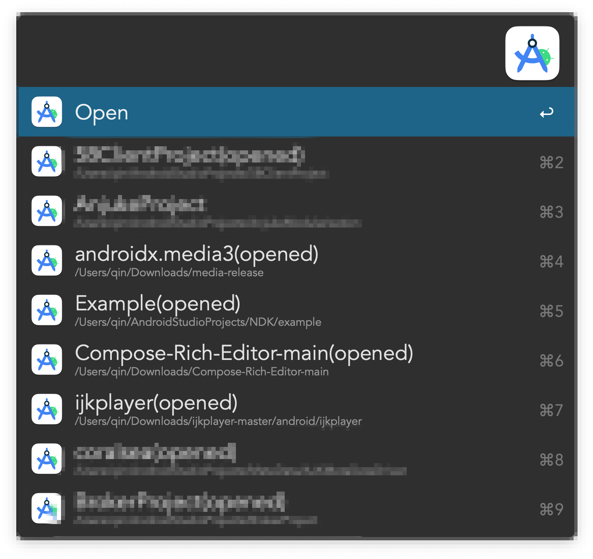
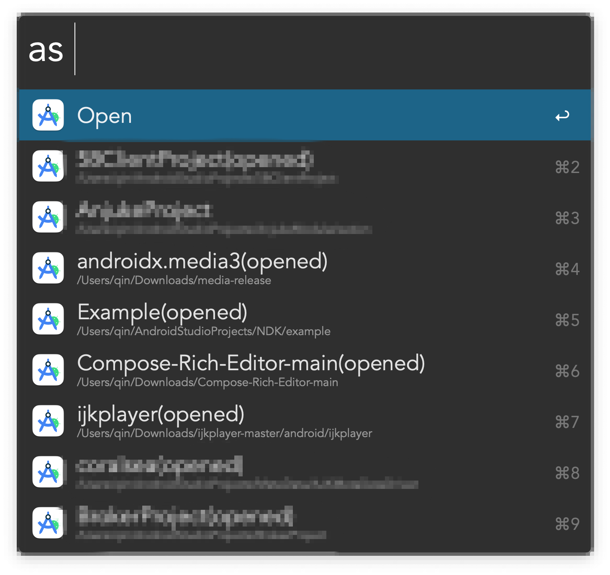

## Android Studio

*Alfred工作流，快速启动Android Studio软件中打开过的项目*
*Alfred workflow for Android Studio*

### 运行环境

* MacOS
* Nodejs 14.x.x
* Alfred Powerpack
* Android Studio

### 安装

[安装包](Android%20Studio.alfredworkflow)

### 使用方法

可使用 option + A 快捷键调出as工作流搜索框(或者调出alfred搜索框输入关键字 as)

回车可使用Android Studio打开项目, 按住Command键回车可在Finder中打开项目

# alfred-androidstudio
